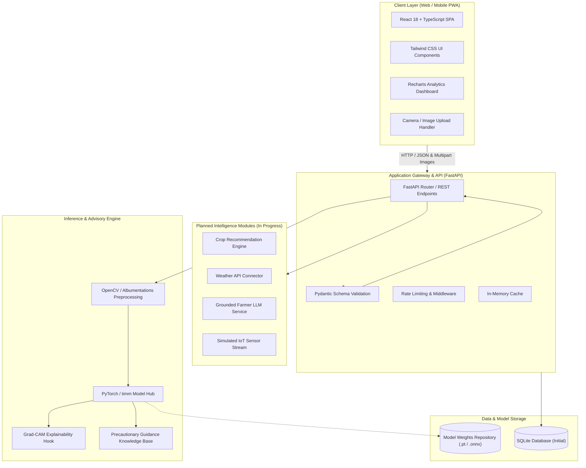

# AgriSmart AI

> *"See the crop. Understand the risk. Take the right action."*

[](https://www.sih.gov.in/)
[](https://www.python.org/)
[](https://fastapi.tiangolo.com/)
[](https://react.dev/)
[](https://pytorch.org/)
[](LICENSE)
[]()

---

## 1. Project Overview

**AgriSmart AI** is an intelligent, AI-powered agricultural decision-support system engineered for the **Smart India Hackathon (SIH) 2026**. The platform addresses critical crop health challenges by combining deep-learning-based computer vision for instant leaf disease diagnosis with actionable, agronomy-grounded advisory workflows.

Rather than providing isolated predictions, AgriSmart AI bridges the gap between machine learning classification and real-world farm management—empowering farmers, extension workers, and agricultural officers to accurately identify crop pathogens, evaluate severity, and take targeted preventive actions before losses escalate.

---

## 2. Problem Statement

Agriculture in India and across developing economies faces chronic yield losses caused by plant diseases, pests, and unpredictable climatic stress:
- **Delayed & Inaccurate Diagnosis**: Farmers often rely on visual inspection without expert guidance, leading to misidentification and incorrect treatment.
- **Indiscriminate Chemical Application**: Overuse of inappropriate fungicides and pesticides harms soil ecosystems, increases input costs, and induces pathogen resistance.
- **Fragmented Advisory Channels**: Critical advisory data—including weather alerts, soil conditions, and disease containment protocols—is rarely unified into a single, farmer-centric decision system.

**AgriSmart AI** solves this by establishing an accessible, transparent, and clinically validated digital diagnostic pipeline starting right from a smartphone or field camera image.

---

## 3. Objectives

- **Accurate Computer Vision Diagnosis**: Build a robust deep learning pipeline utilizing transfer learning to classify crop leaf imagery into healthy and disease categories aligned with official SIH problem statements.
- **Explainable & Trustworthy AI**: Integrate visual interpretability (Grad-CAM) to verify that model predictions are grounded in actual lesion patterns rather than background artifacts.
- **Actionable Precautionary Guidance**: Map diagnostic outputs to immediate, scientifically verified biological and chemical mitigation protocols.
- **Comprehensive Decision Support**: Architect extensible intelligence modules for crop recommendation, weather-indexed risk alerts, and farmer assistance.
- **Methodological Rigor**: Enforce strict train/validation/test hygiene and evaluate against class-balanced metrics (Macro-F1, per-class recall) rather than inflated raw accuracy.

---

## 4. Key Features

```
Feature Status Legend:
[Core]        Mandatory core functionality (Targeted for Initial Benchmark)
[In Progress] Actively under development / pipeline construction
[Planned]     Architected for phased rollout in subsequent milestones
```

### 4.1 Mandatory Core Modules
- **[Core] Crop Disease Visual Classifier**: Deep learning inference pipeline classifying uploaded leaf images into healthy and disease classes based on the SIH class taxonomy.
- **[Core] Transfer Learning Architecture**: Leverages state-of-the-art vision backbones (e.g., ConvNeXt, EfficientNet-V2, ResNet via `timm`) fine-tuned for agricultural phytopathology.
- **[Core] Precautionary Treatment Guidance**: Immediate, verified guidelines detailing disease symptoms, cultural control practices, biological remedies, and recommended chemical formulations.
- **[Core] Rigorous Validation & Reporting**: Macro-F1 score, confusion matrices, and per-class precision/recall tracking across segregated test partitions.

### 4.2 Planned Intelligence Modules
- **[In Progress] Explainable AI (Grad-CAM)**: Heatmap visual overlays highlighting leaf regions that drove the model's classification decision.
- **[In Progress] Field-Image Robustness Pipeline**: Image augmentation suite (shadows, blur, variable lighting, background noise) via Albumentations to simulate in-field conditions.
- **[Planned] Crop Recommendation Engine**: Multi-parameter agronomic matching based on soil N-P-K levels, soil pH, temperature, humidity, and rainfall indicators.
- **[Planned] Smart Irrigation Advisor**: Evapotranspiration and soil moisture-driven watering recommendations to optimize water resource usage.
- **[Planned] Weather Intelligence & Risk Warning**: Localized meteorological forecasts integrated with microclimate disease risk indices (e.g., fungal spore infection risk windows).
- **[Planned] Grounded Farmer Assistant (GenAI)**: Domain-grounded conversational agent providing contextual Q&A strictly validated against verified agricultural knowledge bases.
- **[Planned] Regional Language Interface**: Multilingual localization prioritizing major Indian regional languages for accessibility in rural farming communities.
- **[Planned] Simulated IoT Sensor Telemetry**: Ingestion pipeline for simulated soil moisture, ambient humidity, and temperature sensor arrays.
- **[Planned] Farm Sustainability Score**: Quantitative index evaluating eco-friendly farming practices, pesticide stewardship, and resource preservation.
- **[Planned] Agentic Agricultural Advisor**: Autonomous multi-step reasoning agent synthesizing weather forecasts, soil telemetry, and diagnostic history to generate prioritized farm action plans.

---

## 5. System Architecture

AgriSmart AI follows a decoupled, service-oriented architecture designed for high availability, fast inference latency, and independent module extensibility.



---

## 6. Technology Stack

| Domain | Technology / Framework | Primary Purpose |
| :--- | :--- | :--- |
| **Frontend** | React 18, TypeScript, Vite | High-performance, type-safe single-page web application |
| **Styling & UI** | Tailwind CSS, Lucide Icons | Responsive, accessible, mobile-first design system |
| **Data Visualization** | Recharts | Interactive confusion matrices, telemetry graphs, and confidence bars |
| **Backend Framework**| Python 3.10+, FastAPI, Uvicorn | Asynchronous REST API and gateway service |
| **Data Validation** | Pydantic v2 | Strict request/response payload schemas and runtime typing |
| **Deep Learning** | PyTorch, torchvision, timm | Model training, transfer learning, and GPU/CPU inference |
| **Computer Vision** | OpenCV, Pillow, Albumentations | Image resizing, color space corrections, and field augmentations |
| **Model Evaluation** | scikit-learn | Calculation of Macro-F1, per-class precision/recall, and confusion matrices |
| **Explainability** | pytorch-grad-cam | Saliency and gradient-weighted class activation mapping |
| **Database** | SQLite (Initial) | Lightweight local persistence for diagnostic logs, advisory records, and feedback |
| **Testing** | pytest, FastAPI TestClient, HTTPX | Automated unit, integration, and endpoint testing |
| **DevOps & CI/CD** | Git, GitHub Actions, Docker | Containerized deployments and automated build/lint/test workflows |
| **External Integrations**| OpenWeatherMap / IMD API, Grounded LLM API | Weather forecasting and natural language advisory reasoning |

---

## 7. AI/ML Methodology

```
+-----------------------------------------------------------------------------------+
|                            AI/ML Diagnostic Pipeline                              |
|                                                                                   |
|  [Input Image]                                                                    |
|        │                                                                          |
|        ▼                                                                          |
|  [Validation & Sanity] ──► Validates MIME type, resolution, and format integrity   |
|        │                                                                          |
|        ▼                                                                          |
|  [Preprocessing]      ──► Resize (224x224/384x384), RGB normalize (ImageNet stats) |
|        │                                                                          |
|        ▼                                                                          |
|  [Augmentation]       ──► Geometric & color perturbations (Albumentations)        |
|        │                                                                          |
|        ▼                                                                          |
|  [Transfer Learning]  ──► Deep CNN / Vision Transformer Backbone (timm)           |
|        │                                                                          |
|        ▼                                                                          |
|  [Softmax Head]       ──► Class probability distribution across SIH taxonomy      |
|        ├─────────────────────────────┐                                            |
|        ▼                             ▼                                            |
|  [Decision & Metrics]        [Grad-CAM Saliency]                                  |
|  Healthy vs Disease Label    Lesion Activation Heatmap                            |
|        │                             │                                            |
|        └──────────────┬──────────────┘                                            |
|                       ▼                                                           |
|        [Precautionary Guidance Engine]                                            |
|        Scientific prevention, cultural practices, and biological/chemical remedies|
+-----------------------------------------------------------------------------------+
```

### 7.1 Transfer Learning Strategy
Agricultural image classification benefits significantly from models pre-trained on expansive visual representations (e.g., ImageNet-1k / ImageNet-22k). AgriSmart AI evaluates standard and modern vision architectures:
- **Lightweight / Edge-ready**: MobileNetV3 / EfficientNet-B0 (optimized for constrained environments)
- **High-Capacity Vision Backbones**: ConvNeXt-Tiny/Small, EfficientNet-V2, and ResNet-50 via `timm`

Fine-tuning is conducted via a two-stage regime:
1. **Feature Extraction Phase**: Freezing the convolutional/transformer backbone and optimizing only the classification head with standard cross-entropy loss.
2. **End-to-End Fine-Tuning Phase**: Unfreezing top backbone layers with a low learning rate using Cosine Annealing with Warm Restarts to adapt feature extractors to leaf vein and lesion patterns.

### 7.2 Data Augmentation & Field Robustness
To mitigate laboratory bias and prevent overfitting on uniform studio backgrounds, the training pipeline leverages **Albumentations**:
- Random horizontal and vertical flips
- Random brightness, contrast, and hue shifts
- Gaussian blur and motion blur (simulating camera instability)
- Coarse dropout / Cutout (simulating partial leaf occlusions)

### 7.3 Model Explainability (Grad-CAM)
Trust is paramount for agricultural adoption. Grad-CAM computes gradients of the target class score with respect to the feature map of the final convolutional layer. This produces a coarse localization heatmap highlighting the diseased regions, allowing human verifiers to confirm that the model is targeting the leaf pathology and not irrelevant background artifacts.

> [!NOTE]
> Training scripts, hyperparameter configuration files, and checkpoint evaluation pipelines are structured in `backend/ml/`. Official benchmark figures will be posted once the ML team completes full dataset training.

---

## 8. Dataset and Data Split Methodology

A rigorous data discipline prevents target leakage and ensures field generalizability.

### 8.1 Class Taxonomy
The dataset structure conforms to the designated **SIH 2026** crop disease list, covering major economic crops (e.g., Tomato, Potato, Rice, Wheat, Cotton, Corn) categorized into:
- Healthy plant leaf samples
- Specific fungal, bacterial, viral, and pest-induced leaf pathologies

### 8.2 Partitioning & Leakage Prevention
To guarantee honest and reproducible evaluation:
- **Stratified Splitting**: Splits maintain exact class proportions across all subsets.
  - **Training Set (70%)**: Used exclusively for parameter optimization.
  - **Validation Set (15%)**: Used solely for hyperparameter tuning, early stopping, and model selection.
  - **Holdout Test Set (15%)**: Completely quarantined until final evaluation.
- **Leakage Prevention Protocols**:
  - Image augmentations are applied **strictly** to the training split.
  - Test and validation splits undergo only deterministic resizing and ImageNet normalization.
  - If multi-shot bursts or images from identical plants are identified, grouping is enforced to ensure no shared plant identity across splits.

---

## 9. Evaluation Metrics

Accuracy alone is an unreliable metric for agricultural datasets due to natural class imbalances. AgriSmart AI evaluates all candidate checkpoints against multi-class classification criteria:

- **Macro-F1 Score**: Unweighted mean of F1-scores across all classes. Penalizes models that perform poorly on rare or under-represented disease classes.
- **Categorical Accuracy**: Overall proportion of correct predictions across the benchmark.
- **Per-Class Precision & Recall**:
  $$\text{Precision}_c = \frac{TP_c}{TP_c + FP_c}, \quad \text{Recall}_c = \frac{TP_c}{TP_c + FN_c}$$
- **Confusion Matrix**: Full $N \times N$ matrix mapping true vs. predicted disease labels to uncover inter-class misclassification patterns.

### 9.1 Benchmark Results

> [!IMPORTANT]
> The table below reflects our standardized benchmark schema. In adherence to SIH academic integrity standards, benchmark values will be populated once training on the finalized dataset is executed and independently verified by the ML team.

| Model Backbone | Parameters | Input Resolution | Test Accuracy | Macro-F1 | Inference Latency (CPU) | Status |
| :--- | :---: | :---: | :---: | :---: | :---: | :---: |
| *Baseline ResNet-50* | ~25.6M | 224x224 | *[To be populated]* | *[To be populated]* | *[To be populated]* | In Pipeline |
| *EfficientNet-V2-S* | ~21.5M | 384x384 | *[To be populated]* | *[To be populated]* | *[To be populated]* | In Pipeline |
| *ConvNeXt-Tiny* | ~28.6M | 224x224 | *[To be populated]* | *[To be populated]* | *[To be populated]* | In Pipeline |
| *MobileNetV3-Large* | ~5.4M | 224x224 | *[To be populated]* | *[To be populated]* | *[To be populated]* | In Pipeline |

---

## 10. Project Structure

```
AgriSmart-AI/
├── .github/
│   └── workflows/
│       ├── backend-ci.yml           # Automated pytest & flake8 linting
│       └── frontend-ci.yml          # TypeScript checks & build validation
├── backend/
│   ├── app/
│   │   ├── api/
│   │   │   ├── v1/
│   │   │   │   ├── endpoints/
│   │   │   │   │   ├── disease.py   # Image upload & disease prediction
│   │   │   │   │   ├── advisory.py  # Precautionary guidance endpoints
│   │   │   │   │   ├── weather.py   # Weather risk analysis [Planned]
│   │   │   │   │   └── health.py    # System health & readiness checks
│   │   │   │   └── api_router.py    # Central API route registration
│   │   ├── core/
│   │   │   ├── config.py            # Pydantic Settings & environment vars
│   │   │   └── security.py          # CORS & API security rules
│   │   ├── db/
│   │   │   ├── session.py           # SQLite engine & session management
│   │   │   └── models.py            # Diagnostic logs & advisory schemas
│   │   ├── schemas/
│   │   │   ├── prediction.py        # Pydantic request/response models
│   │   │   └── advisory.py          # Precautionary guidance models
│   │   ├── services/
│   │   │   ├── inference.py         # PyTorch inference service
│   │   │   ├── explainability.py    # Grad-CAM generation service
│   │   │   └── advisory_service.py  # Treatment guidance mapper
│   │   └── main.py                  # FastAPI application entry point
│   ├── ml/
│   │   ├── datasets/                # Dataset download & verification scripts
│   │   ├── configs/                 # YAML training configs
│   │   ├── models/                  # Architecture definitions via timm
│   │   ├── train.py                 # Training script with validation loops
│   │   └── evaluate.py              # Macro-F1, confusion matrix generator
│   ├── tests/
│   │   ├── test_api.py              # FastAPI endpoint tests
│   │   └── test_inference.py        # ML inference pipeline tests
│   ├── Dockerfile
│   ├── requirements.txt
│   └── requirements-dev.txt
├── frontend/
│   ├── public/                      # Static assets and icons
│   ├── src/
│   │   ├── assets/                  # Images and SVG icons
│   │   ├── components/
│   │   │   ├── common/              # Buttons, Cards, Modals, Navbar
│   │   │   ├── disease/             # UploadZone, ResultCard, GradCAMViewer
│   │   │   ├── advisory/            # TreatmentSteps, ChemicalSafetyCard
│   │   │   └── dashboard/           # MetricsWidget, AnalyticsSummary
│   │   ├── hooks/                   # Custom React hooks (useDiseasePredict, etc.)
│   │   ├── services/                # API client (Axios/Fetch wrapper)
│   │   ├── types/                   # TypeScript interfaces & API types
│   │   ├── utils/                   # Formatting and helper utilities
│   │   ├── App.tsx                  # Root application component
│   │   └── main.tsx                 # Application entry point
│   ├── index.html
│   ├── package.json
│   ├── tailwind.config.js
│   ├── tsconfig.json
│   └── vite.config.ts
├── docker-compose.yml
├── .gitignore
├── LICENSE
└── README.md
```

---

## 11. How to Run

### 11.1 Prerequisites
- **Python**: Version `3.10` or higher
- **Node.js**: Version `18.x` or `20.x` LTS (`npm` or `yarn`)
- **Git**: Installed and configured
- *(Optional)* **NVIDIA GPU** with CUDA support for accelerated model inference/training

---

### 11.2 Backend Setup (FastAPI)

1. **Clone the repository:**
   ```bash
   git clone https://github.com/<your-org-or-username>/AgriSmart-AI.git
   cd AgriSmart-AI/backend
   ```

2. **Create and activate a virtual environment:**
   ```bash
   # Windows (PowerShell)
   python -m venv venv
   .\venv\Scripts\Activate.ps1

   # Linux / macOS
   python3 -m venv venv
   source venv/bin/activate
   ```

3. **Install dependencies:**
   ```bash
   pip install --upgrade pip
   pip install -r requirements.txt
   ```

4. **Configure environment variables:**
   ```bash
   cp .env.example .env
   # Edit .env to adjust host, port, model weights path, or API keys
   ```

5. **Start the FastAPI backend server:**
   ```bash
   uvicorn app.main:app --host 0.0.0.0 --port 8000 --reload
   ```
   The interactive Swagger API documentation will be accessible at: `http://localhost:8000/docs`

---

### 11.3 Frontend Setup (React + Vite)

1. **Navigate to the frontend directory:**
   ```bash
   cd ../frontend
   ```

2. **Install frontend dependencies:**
   ```bash
   npm install
   ```

3. **Configure environment variables:**
   ```bash
   cp .env.example .env
   # Ensure VITE_API_BASE_URL points to http://localhost:8000
   ```

4. **Start the Vite development server:**
   ```bash
   npm run dev
   ```
   The application dashboard will be live at: `http://localhost:5173`

---

### 11.4 Running via Docker Compose

To launch both frontend and backend in isolated containers:
```bash
# From the repository root
docker-compose up --build
```

---

### 11.5 Running Tests

```bash
# Run backend tests with pytest
cd backend
pytest tests/ -v

# Run frontend linting & type checks
cd ../frontend
npm run lint
npm run build
```

---

## 12. API Overview

The backend exposes well-structured, versioned REST endpoints documented via OpenAPI/Swagger.

### Core Endpoints

#### `POST /api/v1/predict/disease`
Uploads a crop leaf image for diagnostic classification and returns class probabilities and precautionary measures.
- **Request**: `multipart/form-data` with key `file` (image format: JPEG, PNG).
- **Response (`200 OK`)**:
  ```json
  {
    "status": "success",
    "prediction": {
      "crop": "Tomato",
      "condition": "Early Blight",
      "is_healthy": false,
      "confidence": 0.942,
      "class_id": 14
    },
    "top_predictions": [
      { "label": "Tomato___Early_blight", "confidence": 0.942 },
      { "label": "Tomato___Target_Spot", "confidence": 0.038 }
    ],
    "explainability": {
      "gradcam_available": true,
      "heatmap_url": "/api/v1/explainability/gradcam/session_xyz.png"
    },
    "guidance": {
      "disease_name": "Early Blight (Alternaria solani)",
      "urgency": "Moderate",
      "cultural_control": [
        "Prune lower infected foliage to prevent splash dispersal.",
        "Ensure adequate plant spacing to facilitate airflow."
      ],
      "biological_control": [
        "Apply Trichoderma-based bio-fungicides during early stages."
      ],
      "chemical_control": [
        "Apply copper-based fungicides or Mancozeb in accordance with local agricultural guidelines."
      ]
    }
  }
  ```

#### `GET /api/v1/health`
Verifies backend service operational health, model readiness, and database availability.
- **Response (`200 OK`)**:
  ```json
  {
    "status": "healthy",
    "model_loaded": true,
    "active_backbone": "efficientnet_v2_s",
    "database": "connected",
    "version": "0.1.0"
  }
  ```

#### `GET /api/v1/advisory/{class_id}`
Retrieves comprehensive precautionary guidelines and mitigation protocols for a specific disease class.

---

## 13. Team and Responsibilities

| Name | Role | Core Responsibilities |
| :--- | :--- | :--- |
| *[Team Member 1]* | **Team Lead & Full-Stack Architect** | System design, repository management, API integration, and SIH coordination |
| *[Team Member 2]* | **AI / Computer Vision Engineer** | PyTorch model development, transfer learning, data augmentation, and benchmark evaluation |
| *[Team Member 3]* | **MLOps & Backend Developer** | FastAPI services, Pydantic schemas, inference latency optimization, and SQLite persistence |
| *[Team Member 4]* | **Frontend & UI/UX Developer** | React/TypeScript dashboard, Tailwind CSS components, camera capture, and Recharts |
| *[Team Member 5]* | **Explainable AI & QA Engineer** | Grad-CAM heatmap implementation, model validation, unit testing, and test automation |
| *[Team Member 6]* | **Agronomy & Domain Researcher** | SIH class taxonomy curation, disease precautionary guidelines, and field dataset validation |

---

## 14. Development Status & Roadmap

```
[x] Completed   [~] In Progress   [ ] Planned
```

- [x] **Phase 1: Project Initialization & Architectural Design**
  - [x] Problem formulation and technical stack selection
  - [x] Decoupled repository scaffolding (FastAPI backend + React/TS frontend)
  - [x] Definition of strict data split and honest evaluation guidelines
- [~] **Phase 2: Core Vision Pipeline & Backend Engine (Current Milestone)**
  - [~] Dataset ingestion and verification aligned with SIH class taxonomy
  - [~] Transfer learning training pipeline implementation with `timm` & Albumentations
  - [x] FastAPI inference endpoints with Pydantic validation
  - [~] Baseline model benchmarking (Macro-F1, Confusion Matrix generation)
  - [~] Grad-CAM visual explainability service hook
- [~] **Phase 3: Interactive Frontend & Advisory Dashboard**
  - [x] React 18 + Vite + Tailwind CSS shell setup
  - [~] Image upload, camera integration, and live diagnostic result card
  - [~] Precautionary guidance renderer (cultural, biological, and chemical steps)
  - [ ] Interactive confusion matrix and analytics panel
- [ ] **Phase 4: Extended Intelligence Modules**
  - [ ] Crop recommendation based on soil parameters (N-P-K, pH)
  - [ ] Weather API integration and localized infection risk warnings
  - [ ] Grounded Farmer Assistant (LLM advisory with guardrails)
  - [ ] Simulated IoT sensor telemetry pipeline
- [ ] **Phase 5: Field Hardening, Testing & SIH Submission**
  - [ ] End-to-end integration tests (pytest + HTTPX)
  - [ ] Docker containerization and deployment validation
  - [ ] Final verification against holdout test datasets

---

## 15. Limitations

To maintain transparency and engineering integrity:
- **Field Lighting & Blur Sensitivity**: Extreme overexposure, heavy shadows, or motion blur from low-cost smartphone cameras can degrade classification confidence.
- **Multiple Co-occurring Pathologies**: The initial model handles single dominant leaf condition classification; co-infection multi-label segmentation is not supported in the initial release.
- **Controlled vs. In-Field Background Gap**: Laboratory-collected images often feature plain backgrounds; models may experience domain shift when deployed in unconstrained field environments with busy soil/weeds backgrounds.
- **Connectivity Requirements**: High-precision inference currently runs via the central FastAPI backend, requiring internet connectivity (edge offline inference is planned for future iterations).
- **Advisory Scope**: Precautionary advice provided by the system serves as an early decision aid and does not supersede local certified agronomic or government extension authority mandates.

---

## 16. Future Scope

- **Edge & Mobile Optimization**: Quantize models using ONNX Runtime or TensorFlow Lite to enable zero-latency, offline disease detection on standard Android devices.
- **UAV / Drone Imagery Integration**: Support high-resolution drone orthomosaic imagery for field-scale crop stress mapping.
- **Multilingual Voice Interface**: Integrate automatic speech recognition (ASR) and text-to-speech (TTS) in regional languages (Hindi, Marathi, Telugu, Tamil, Punjabi, etc.) for non-literate farmers.
- **Automated IoT Sensor Mesh**: Connect live ESP32/LoRaWAN field telemetry for real-time soil moisture and microclimate tracking.
- **Multi-Modal Agronomic Agent**: Combine visual lesion analysis with ambient weather history and soil chemistry to deliver holistic prescriptive farm plans.

---

## 17. Dataset & Source Attribution

- **Plant Pathology Datasets**: Built upon open research benchmarks including PlantVillage, public ICAR datasets, and open agricultural image repositories.
- **Deep Learning Libraries**: PyTorch team, Ross Wightman (`timm` library), and the Albumentations team for image augmentations.
- **Visual Explainability**: Jacob Gildenblat (`pytorch-grad-cam`).
- **Agricultural Advisory References**: Curated in consultation with recommendations from the Indian Council of Agricultural Research (ICAR) and state agricultural university extension manuals.

---

## 18. License

This project is licensed under the **MIT License** - see the [LICENSE](LICENSE) file for full details.

---

<p align="center">
  <b>AgriSmart AI — Smart India Hackathon (SIH) 2026</b><br>
  <i>"See the crop. Understand the risk. Take the right action."</i>
</p>
